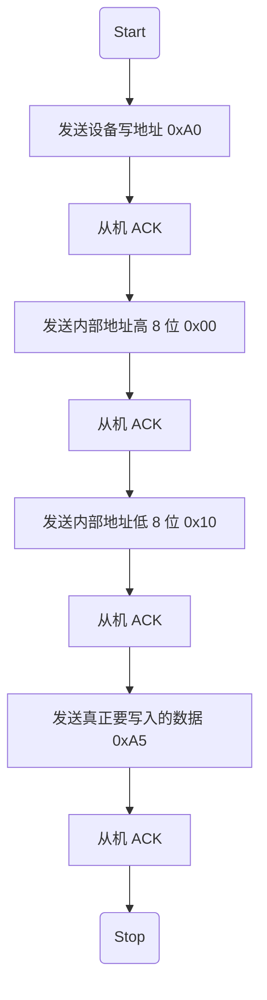

# IIC（Inter-Integrated Circuit Bus）
---
## 1.缩写名
SDA：Serial Data Line——串行数据线

SCL：Serial Clock Line——串行时钟线

ACK：Acknowledge Character——应答信号

## 2.特点
&emsp;&emsp; IIC是一种**多主机、两线制、低速串行通信总线，广泛用于微控制器和各种外围设备之间的通信**。它使用两条线路：串行数据线（SDA）和串行时钟线（SCL）进行双向传输。因为很多外设都会使用同一组的SCL和SDA，所以IIC协议规定：每次通信开始后，主机都必须先发送设备地址。设备地址就是告诉所有的从机，主机现在要和设备是0x50的设备通信，其他设备不要说话。

总线结构：

&emsp;&emsp; 两线制：**使用两条线进行通信，分别是串行数据线（SDA）和串行时钟线（SCL）。** 写入和读取数据就是写入和读取SDA内的电平，SDA为高代表1，为低代表0。不管整场通信是单片机传数据给传感器（写），还是传感器传数据给单片机（读）。在这期间的每一个 Bit 传输，都必须遵循：“SCL 为低时，发送方往线上面写/摆放数据；SCL 为高时，接收方去线上读/抓取数据”
  
  多主多从结构：支持多个主设备和多个从设备连接到同一总线上。
  
通信方式：

&emsp;&emsp; 同步串行：**数据传输同步于时钟信号。**
  
&emsp;&emsp; 字节格式：**每个字节由8位数据构成，加上开始和停止条件以及可选的应答位（ACK）。**

## 3.SDA与SCL

| 信号线名称 | 核心角色 | 物理特性 | 核心职责 |
| :---: | :---: | :---: | :---: |
| SCL (Serial Clock Line) | 总线节拍器（指挥官） | 单向或准双向(通常由主机控制) | 提供稳定的时钟脉冲，决定数据传输的快慢，强制让发送方和接收方步调一致。 |
| SDA (Serial Data Line) | 数据运输车（大马路） | 完全双向(分时复用控制权) | 负责传输所有实质性的数据（如设备地址、读写位、寄存器数据、ACK/NACK 应答信号）。 |

对应有四种状态：

1. **空闲状态（Idle）** 规矩：SCL = 1 且 SDA = 1。物理含义：总线静悄悄，谁也没有说话，等待主控发起呼叫。
  
2. **启动信号**（Start）规矩：当 SCL 保持高电平（1）不变时，SDA 突然被狠狠拉低（0）。物理含义：主控单片机清了清嗓子，向整条总线宣告：“注意了！通信开始，大家都给我立正听好！”
  
3. **停止信号**（Stop）规矩：当 SCL 保持高电平（1）不变时，SDA 突然从低电平（0）跳变回高电平（1）。物理含义：主控单片机宣告：“本次通话结束，总线释放，大家可以休息了。”
  
4. **数据有效性**（Data Validity）规矩：**SCL 为低电平（0）时：允许 SDA 改变状态（发送方此时在代码里切换 SDA 极性）。SCL 为高电平（1）时：SDA 必须死死保持稳定，绝对不能有任何抖动！接收方会在这段高电平期间去读取 SDA 的真实值（1 或 0）。**

&emsp;&emsp; 打破规矩的后果：如果在 SCL 为高电平时，SDA 没稳住发生了跳变，接收方就会误把这个跳变当成上面的“启动”或“停止”信号，导致整场通信直接崩溃乱套。


##  4.IIC 开始与停止时序


当SCL 是高电平时，SDA 线从高电平向低电平切换表示起始条件；

当SCL 是高电平时，SDA 线由低电平向高电平切换表示停止条件。

## 5.IIC 读写数据
&emsp;&emsp; 在 I2C 协议中，**在SDA中写入 1 个比特（Bit），SCL 时钟线就必须雷打不动地跳变一次**（完成一次“低 ➡️ 高 ➡️ 低”的完整脉冲），及每写入一个bit，从机就会去读取这个数据，来实现同步通信的效果，因为都是由同一根SCL控制，主从机之间就可以实现100%绝对精准、绝对不丢包的硬件沟通。
### 5.1写数据（主设备给从设备发送/写入数据）：


1. 主设备发送起始（START）信号

2. 主设备发送设备地址到从设备

3. 等待从设备响应(ACK)

4. 主设备发送数据到从设备，一般发送的每个字节数据后会跟着等待接收来自从设备的响应(ACK)

5. 数据发送完毕，主设备发送停止(STOP)信号终止传输

### 5.2读数据（主设备从从设备接收/读取数据）


1. 设备发送起始（START）信号

2. 主设备发送设备地址到从设备

3. 等待从设备响应(ACK)

4. 主设备接收来自从设备的数据，一般接收的每个字节数据后会跟着向从设备发送一个响应(ACK)

5. 一般接收到最后一个数据后会发送一个无效响应(NACK)，然后主设备发送停止(STOP)信号终止传输

&emsp;&emsp; 设备地址：从设备地址用来区分总线上不同的从设备，**一般发送从设备地址的时候会在最低位加上读/写信号，比如设备地址为0x50，0表示读，1表示写，则读数据就会发送0xA0，写数据就会发送0xA1。**

## 6.数据有效性


&emsp;&emsp; I2C总线进行数据传送时，在SCL的每个时钟脉冲期间传输一个数据位，**时钟信号SCL为高电平期间，数据线SDA上的数据必须保持稳定，只有在时钟线SCL上的信号为低电平期间，数据线SDA上的高电平或低电平状态才允许变化**，因为当SCL是高电平时，数据线SDA的变化被规定为控制命令（START或STOP，也就是前面的起始信号和停止信号）


## 7.应答信号（ACK/NACK）

&emsp;&emsp; 接收端收到有效数据后向对方响应的信号，**发送端每发送一个字节(8位)数据，在第9个时钟周期释放数据线去接收对方的应答**。

**当SDA是低电平为有效应答(ACK)，表示对方接收成功；**

**当SDA是高电平为无效应答(NACK)，表示对方没有接收成功。**

## 8.写入数据波形图

向 BL24C512 地址 0x0010，写入数据 0xA5：


**步骤：**



**对应函数：** 
```c 
bl24c512_write_byte(&iic1, 0x0010, 0xA5);
```
**理解：** 定义#define BL24C512_ADDR 0x50，**及设备地址是0x50**，但是IIC在真正的线上传输的时候会变成8位，最低位会有一个读写位。**0是写，1是读，所以整体的地址会变为0xA0**。之后发送16位的存储地址，0x0010，在IIC中是先发高位再发低位，所以先发00再发10。最后再发真正要发送的内容0xA5.

## 9.读取数据波形图

读 BL24C512 地址 0x0010，读到数据 0xA5：


**步骤：**

1.Start

2.发送设备写地址 0xA0

3.从机 ACK

4.发送 EEPROM 内部地址高 8 位 0x00

5.从机 ACK

6.发送 EEPROM 内部地址低 8 位 0x10

7.从机 ACK

8.Repeated Start

9.发送设备读地址 0xA1

10.从机 ACK

11.读取数据 0xA5

12.主机发送 NACK

13.Stop

**对应函数：** 
```c
read_data = bl24c512_read_byte(&iic1, 0x0010);
```
**理解：** 
想读某个地址之前，**必须先告诉 EEPROM：我要读你内部的哪个存储地址？所以读操作前半段其实是“写地址”：**

    Address write: A0
    
    Data write: 00
    
    Data write: 10

&emsp;&emsp; 设置EEPROM的内部地址指针为：0x0010，里面会涉及两个地址，第一个0xA0代表从机地址（0x50的写入），第二个0x0010代表从机的内部地址指针。

**Sr是Repeat Start**，重复起始信号，它的作用是：不释放 IIC 总线，**直接从写地址阶段切换到读数据阶段**

&emsp;&emsp; 所以**读 EEPROM 的标准流程**是：**Start、设备地址 + 写、内部地址（告诉设备）、Repeated Start、设备地址 + 读、读数据Stop**

在读地址的时候是A1，因为读操作的地址是
```c
(BL24C512_ADDR << 1) | 0x01        //从 BL24C512 的内部地址 0x0010 读取 1 个字节
```
最后读到数据位0xA5，即为之前写入的数据


